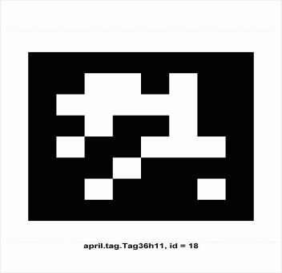
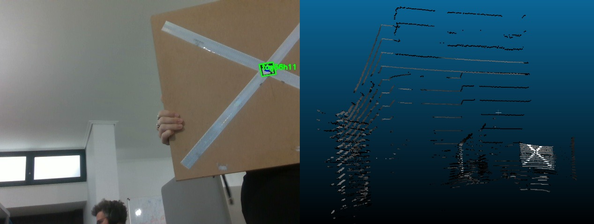
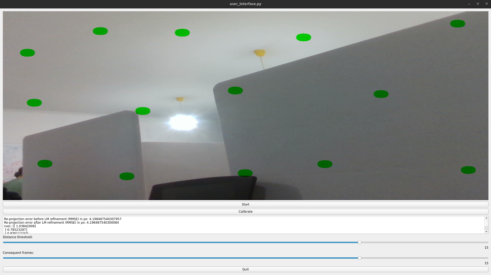

# Lidar - Camera Calibration


## Wiki
You can visit the ros wiki with more information regarding the calibration package.

[An Effective Camera-to-Lidar Spatiotemporal Calibration Based
on a Simple Calibration Target [pdf]](https://www.mdpi.com/1424-8220/22/15/5576/pdf?version=1658889926)

[cam2lidar](http://wiki.ros.org/cam2lidar)

[cam2lidar tutorial](http://wiki.ros.org/cam2lidar/Tutorials/How%20to%20calibrate%20Lidar%20and%20Camera)

## Run through Docker

1. Clone the repository.
2. Execute (inside the folder):

```
docker build .
```

3. Run the image (with X11 support):
```
docker run --gpus all -it --privileged -e DISPLAY -v /tmp/.X11-unix:/tmp/.X11-unix -v <repository location>:/cam2lidar <image number>
```
Inside the container:
```
cd /root/catkin_ws
ln -sf /cam2lidar/ src/
catkin_make
source devel/setup.bash 
```


Notes:
To enable the GUI do not forget to run this on a local terminal.
```
xhost +
```
Also, use this docker run command to share the same roscore between the docker container and the host.
```
docker run --gpus all -it --privileged --net=host -e DISPLAY -v /tmp/.X11-unix:/tmp/.X11-unix -v <repository location>:/cam2lidar <image number>
```

## Prepare data for calibration


There are two topics that are necessary for the calibration process. One for video and one for Lidar.
In addition, you will need the intrinsic parameters of the camera.
Then set the input topics at the launch file that you will execute.

## Geometric calibration

Run the bagfile (or publish the necessary topics), execute:

```
roslaunch cam2lidar geometric.launch
```

and set the following parameters in the config folder.

```
# Geometric calibration
reproj_error: 8
intensity_thres: 200
distance_from_prev: 100
horizontal_dimension: 3840
vertical_dimension: 2160
grid_horizontal_division: 5
grid_vertical_division: 5
```

**reproj_error**: Reprojection error of PnP

**intensity_thres**: Lidar intensity threshold that is considered to be coming from the reflective tape

**distance_from_prev**: Distance (in px) from previous apriltag in order for the movement to be considered as static

**horizontal_dimension/vertical_dimension**: Dimensions of the image

**grid_horizontal_division/grid_vertical_division**: Shape of grid, in order to have one measurement per rectangle

## Temporal calibration

Run the bagfile (or publish the necessary topics), execute:

```
roslaunch cam2lidar temporal.launch
```

and set the parameters as mentioned in the Geometric calibration section.

## Example

The repository was recently (04/2024) tested using Velodyne VLP16 and RealSense D435i. 

The Velodyne Lidar can be installed inside the running container using the [official guide](https://wiki.ros.org/velodyne/Tutorials/Getting%20Started%20with%20the%20Velodyne%20VLP16). The RealSense camera can be used after following the instructions for installing [ROS Wrapper](https://github.com/IntelRealSense/realsense-ros/tree/ros1-legacy).

The calibration launch file can be run after configuring the calibration parameters in the config folder. The user can adjust the `Distance Threshold` and `Consequent Frame` parameters via the user interface and then click `Start` to start the process; for more details, see the [official tutorial](http://wiki.ros.org/cam2lidar/Tutorials/How%20to%20calibrate%20Lidar%20and%20Camera).

Here is an example of the detected AprilTag.


The detected points should be at least 4 and cover the whole area of the camera's field of view.


The calibration results are saved in the `/cam2lidar/output/geometric_calibration.txt` file.
The `/cam2lidar/output/` directory also contains other 4 files that are:
- `image_points.txt`: The position of the detected AprilTag on the images (in pixels)
- `lidar_points.txt`: The position of the detected AprilTag on the point clouds (in meters)
- `rotation_vector.txt`: Computed rotation vector
- `translation_vector.txt`: Computed translation vector

Changing the `debug` parameter in the launch file allows the images and point clouds used in calibration to be saved in the `/cam2lidar/output/geometric` folder.

You can experiment with the software using the [sample dataset (rosbag)](https://filebrowser.homelab.up2metric.com/share/JJw-BnDA).

To test the software, first play the bagfile:
```
rosbag play <bagfile>
```
and then execute:
```
roslaunch cam2lidar geometric.launch
```

# Citations
[](https://doi.org/10.3390/s22155576)

The following is a [BibTeX](www.bibtex.org) entry for the Cam2lidar paper that you should cite if you use this model.
```
@article{grammatikopoulos2022effective,
  title={An Effective Camera-to-Lidar Spatiotemporal Calibration Based on a Simple Calibration Target},
  author={Grammatikopoulos, Lazaros and Papanagnou, Anastasios and Venianakis, Antonios and Kalisperakis, Ilias and Stentoumis, Christos},
  journal={Sensors},
  volume={22},
  number={15},
  pages={5576},
  year={2022},
  publisher={Multidisciplinary Digital Publishing Institute}
}
```

